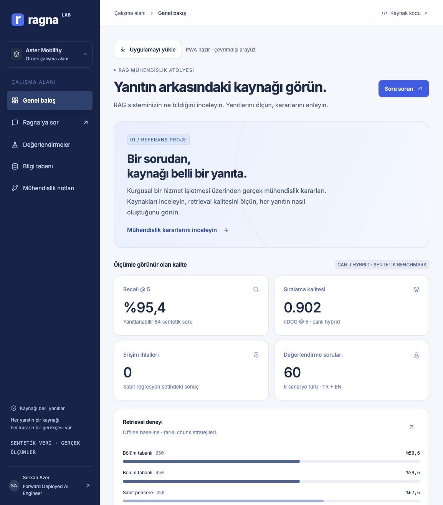
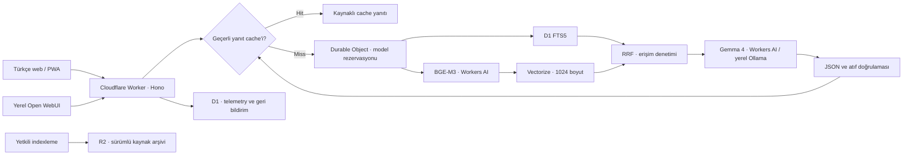

# RAGNA

### Kaynağı belli yanıtlar. Ölçülebilir mühendislik kararları.

[Serkan Azeri](https://www.serkanazeri.com/) tarafından geliştirilen, **Forward Deployed AI Engineering** yaklaşımını görünür kılan bir RAG referans projesi. Bir sorunun hangi kaynaklarla yanıtlandığını, retrieval tercihlerinin sonuçlarını ve sistemin gerçek çalışma davranışını aynı uygulamada inceleyin.

**[Canlı uygulama](https://ragna.serkanazeri.workers.dev)** · [Mimari](docs/architecture.md) · [Değerlendirme protokolü](docs/evaluation.md) · [Dağıtım](docs/deployment.md) · [Open WebUI](integrations/open-webui/README.md)



## Çözdüğümüz problem

Bir hizmet ekibi iade, garanti, destek önceliği, tamir ve geçici ekipman politikalarıyla ilgili değişen soruları yanıtlar. Bir cevap birden fazla belgeye dayanabilir. Eski bir politika makul görünse de yanlış olabilir; kurum içi ticari koşullar ziyaretçilerin model bağlamına girmemelidir.

**Aster Mobility kurgusaldır.** Politika belgeleri sentetiktir. İşveren belgeleri, müşteri konuşmaları, CV içeriği veya gizli iş verileri bu projede yer almaz.

Bu proje yalnızca bir sohbet ekranından oluşmaz:

- **Sor ve incele:** Kaynak atıfları, belge sürümleri, yanıt türü, trace kayıtları, geri bildirim ve JSON dışa aktarma.
- **Karşılaştır:** Chunk stratejileri, Recall@5, MRR, nDCG@5 ve erişim ihlali regresyonları.
- **İşlet:** Gerçek istek sayıları, p50/p95, sağlayıcı/fallback, cache hit oranı ve bildirilen maliyet.
- **Bağımsız yayımla:** Demo Cloudflare üzerinde çalışır; bilgisayarın açık olmasına bağlı değildir.
- **Yerelde çalış:** Open WebUI aynı API'ye bağlanır; Gemma 4 Ollama üzerinden çalıştırılabilir.
- **Yükle ve mobilde kullan:** Türkçe, responsive PWA; çevrimdışı açılan uygulama arayüzü ve yerel sunulan Inter fontu.

## Hızlı başlangıç

Node.js 22.12+ ve npm gerekir. Kaynak önizlemesi ve kayıtlı örnekler için model anahtarı gerekmez.

```bash
npm ci
npm run secrets:init
npm run db:local
npm run build
npm run preview
```

[http://localhost:8787](http://localhost:8787) adresini açın. **Ragna'ya sor** bölümünde bir soru yazın veya **Kayıtlı örneği göster** seçeneğini kullanın. Hot reload için `npm run dev` ile port 5173'ü açın. PWA service worker yalnızca production build'de kaydedilir; PWA kontrolünü `npm run preview` ile yapın.

```bash
npm run build         # TypeScript + frontend + PWA precache manifest
npm test              # Retrieval, cache, sağlayıcı ve bütçe regresyonları
npm run evaluate      # Offline retrieval deneyleri
npm run test:smoke    # 8787 portunda çalışan API'yi kontrol eder
```

### Yerel model

Ollama'da desteklenen bir Gemma 4 sürümünü hazırlayın:

```bash
ollama pull gemma4:e4b
```

Git tarafından dışlanan `.dev.vars` dosyasına ekleyin:

```dotenv
OLLAMA_BASE_URL=http://localhost:11434
MODEL_ROUTE=local-first
LOCAL_MODEL=gemma4:e4b
```

Servisi yeniden başlatın. Makinede zaten kuruluysa `gemma4:12b-mlx` kullanılabilir; adını `ollama list` ile doğrulayın. Yerel ve buluttaki model varyantlarının aynı performansı gösterdiği varsayılmaz. Yerelde thinking kapalıdır ve model çağrısı 45 saniyeyle sınırlandırılır.

### Bulut ve OpenRouter

Canlı uygulama **Cloudflare Workers AI üzerindeki Gemma 4** modelini kullanır. Bunun için OpenRouter veya bilgisayara açılan bir Tunnel gerekmez. Workers AI ücretsiz kotası sonludur; kota aşımı ücretsiz planda model çağrılarını durdurabilir.

OpenRouter isteğe bağlı ikinci sağlayıcıdır. Etkinleştirmek isterseniz `OPENROUTER_API_KEY` değerini `.dev.vars` içine yazıp dağıtım rehberindeki secret adımını uygulayın. Anahtarı tarayıcı koduna veya Git'e eklemeyin. Mevcut demo için zorunlu değildir.

## Mimari



React build'i ve API, **Workers Static Assets** ile aynı dağıtımda sunulur. Ayrı Pages frontend yerine tek origin, tek sürüm ve daha az yapılandırma yüzeyi seçildi. Open WebUI kendi Docker servisi olarak yerelde çalışır; serverless Worker içine gömülmez.

**Cloudflare Tunnel isteğe bağlıdır.** Bilgisayar kapalıyken yerel servisi çalışır tutmaz. Herkese açık demo yerel donanıma bağlı değildir.

## Mühendislik kararları

| Karar                                                   | Neden?                                                                                                                 | Kanıt ve sınır                                                                                                                                                             |
| ------------------------------------------------------- | ---------------------------------------------------------------------------------------------------------------------- | -------------------------------------------------------------------------------------------------------------------------------------------------------------------------- |
| **BGE-M3, 1024 boyut**                                  | Türkçe/İngilizce sorgu ve belgeleri aynı embedding uzayında tutmak; sorgu embedding'ini bilgisayardan bağımsız üretmek | 51 vektör, 52.224 saklanan boyut. Alternatif modellerle eş koşullu üstünlük ölçümü yapılmadı. [Model belgesi](https://developers.cloudflare.com/workers-ai/models/bge-m3/) |
| **Bölüm tabanlı chunk, 450 tahmini token, %10 overlap** | Başlık, sürüm, tarih ve kaynak bağını korumak                                                                          | Offline lexical deneyde sabit pencere daha iyi çıktı; bu sonuç gizlenmedi. Bölüm stratejisinin evrensel üstünlüğü iddia edilmiyor.                                         |
| **FTS5 + dense retrieval + RRF**                        | Kesin terimler ile çok dilli/parafraz sorgular farklı sinyaller gerektiriyor                                           | Her yoldan ilk 20 aday, RRF sabiti 60, son 5 chunk. Skorlar aynı ölçekteymiş gibi toplanmıyor.                                                                             |
| **Gemma 4**                                             | GPU barındırmadan bulut çıkarımı; aynı aileyi yerelde de deneyebilmek                                                  | Model/sağlayıcı ayrı kaydedilir. Sağlayıcı hata verebilir veya JSON/atıf sözleşmesini ihlal edebilir.                                                                      |
| **Exact-match yanıt cache'i**                           | Tekrarlanan sorularda model kotasını ve gecikmeyi azaltmak                                                             | 24 saat TTL; corpus ve yapılandırma değişiminde geçersizleşme; anlamsal benzerliğe göre yanıt paylaşımı yok.                                                               |
| **Atıf doğrulaması**                                    | Bilinmeyen kaynak kimliklerini ve atıfsız yanıtları reddetmek                                                          | Geçerli kaynak kimliği, anlamsal doğruluğu kanıtlamaz.                                                                                                                     |
| **SQL ve vektör erişim filtreleri**                     | Yetkisiz/eski belgeleri model bağlamından önce ayıklamak                                                               | Sonuçlar retrieval sonrasında da kontrol edilir. İki kapsamlı demo, tam tenant/kimlik sistemi değildir.                                                                    |
| **Küçük, açık pipeline**                                | Retrieval, routing, cache, ölçüm ve maliyeti kod incelemesinde görünür tutmak                                          | Hono + TypeScript fonksiyonları. Gereksinim oluşmadan orchestration framework eklenmedi.                                                                                   |
| **PWA ve yerel fontlar**                                | Mobilde kurulum, okunaklı Türkçe tipografi ve çevrimdışı arayüz                                                        | API yanıtları service worker cache'ine yazılmaz. Yeni sorular internet bağlantısı gerektirir.                                                                              |

## Yanıt cache'i nasıl çalışır?

1. Yalnızca herkese açık kapsamda, canlı model tarafından üretilmiş ve atıf denetiminden geçmiş yanıtlar kaydedilir.
2. Soru NFC normalizasyonundan geçirilir; baş/son ve tekrarlanan boşluklar düzenlenir. Harf büyüklüğü ve noktalama korunur. Benzer görünen farklı sorular eşit sayılmaz.
3. SHA-256 anahtarı soru, corpus hash, prompt/cache politikası, model route ve sağlayıcı yapılandırmasını içerir. Ham soru cache tablosunda tutulmaz.
4. D1 kaydı 24 saat geçerlidir. Cache hit sırasında kaynak metni, başlık, sürüm, tarih ve erişim kapsamı yeniden doğrulanır.
5. Geçerli yanıt **Cache yanıtı** etiketi, üretim zamanı ve asıl sağlayıcısıyla gösterilir. Bu istekte token üretimi ve model rezervasyonu sıfırdır.
6. Cache en fazla 1.000 kayıt tutar; yazma sırasında süresi dolan/eski kayıtlar temizlenir. Süresi dolmuş kayıtlar hiçbir zaman sunulmaz. Trafik/yazma yoksa fiziksel silme bir sonraki yazmaya kadar gecikebilir.
7. İç erişim kapsamı, kayıtlı referans örnekleri, abstention ve kaynak alıntısı fallback'leri cache'e alınmaz. Cache hatası normal retrieval yolunu engellemez.

Cache, **model tarafından üretilmiş yanıtı ve kaynaklarını** saklar; hassas bilgi girmeyin. SHA-256 anonimleştirme garantisi değildir. Genel telemetry ham soruyu veya yanıtı saklamaz. Sunucu cache'i çevrimdışı cihazda yanıt üretmez.

Örnek soruları gerçek model çağrılarıyla hazırlamak için:

```bash
RAGNA_URL=https://your-worker.workers.dev npm run cache:warm
```

Bu komut mevcut geçerli cache kayıtlarını kullanır; eksik yanıtlar normal model kotasından üretilir. Üretilemeyen yanıt cache'e alınmaz. Yetkili canlı değerlendirme `refreshCache: true` kullanır; cache hit'i yeni model kalitesi veya inference gecikmesi gibi ölçmez.

## Ölçümler ve sınırları

### Bulutta retrieval — 2 Ekim 2026

Aynı bölüm chunk'ları ve 60 sentetik soru kullanıldı:

| Yapılandırma           | Recall@5  | Holdout recall | nDCG@5    | Retrieval p95 | Gözlenen erişim ihlali |
| ---------------------- | --------- | -------------- | --------- | ------------- | ---------------------- |
| D1 FTS5                | %61,4     | %55,0          | 0,576     | 39 ms         | 0                      |
| D1 FTS5 + BGE-M3 + RRF | **%95,4** | **%95,0**      | **0,902** | 527 ms        | 0                      |

İyileşme ek embedding/vector çağrısı maliyetiyle elde edildi. 24 soruluk test split'inde 20 yanıtlanabilir soru bulunur. Bunlar tek sıralı koşunun sonuçlarıdır; eşzamanlı trafik testi değildir. [Ham retrieval raporu](reports/cloud-retrieval.json).

İlk 24 soruluk üretim koşusunda tüm istekler Workers AI'a ulaştı; İngilizce sorulara Türkçe yanıt ve abstention etiketi sorunları görüldü. [İlk üretim raporu](reports/generation-baseline.json) bu bulguları korur. Prompt/validator düzenlemesi [5 hedefli regresyonda](reports/generation-regression.json) kontrol edildi. Bu örnekler artık dokunulmamış holdout değildir. Stok parafrazı gereken kaynağı hâlâ kaçırabilir. Genel yanıt kalitesi iddiası için yeni kör test gerekir.

### Offline chunk karşılaştırması

| Bellek içi lexical yapılandırma | Recall@5  | MRR       | nDCG@5    | Erişim ihlali |
| ------------------------------- | --------- | --------- | --------- | ------------- |
| Bölüm / 250                     | 0,596     | 0,580     | 0,577     | 0             |
| Bölüm / 450                     | 0,596     | 0,580     | 0,577     | 0             |
| Sabit pencere / 450             | **0,676** | **0,613** | **0,623** | 0             |

Skorlar ilk beş chunk'ın temsil ettiği benzersiz belgeler üzerinden hesaplanır. Küçük bölümler nedeniyle 250/450 varyantları bu sette çoğunlukla aynı sonucu verir. Bellek içi BM25, D1 FTS5 ile aynı arama motoru değildir. [Tekrarlanabilir rapor](reports/evaluations.json).

**Soru aileleri:** 48 single-hop soru (doğrudan Türkçe, Türkçe parafraz, İngilizce); 12 multi-hop, temporal, unanswerable, access-control ve adversarial senaryo. Politikalar dev/test arasında ayrılır; edge case'ler bilinen politikaları tekrar kullanabilir. Veri ve corpus hash değerleri raporlarda saklanır.

| Katman              | Ölçülen                                                                          | Bu ölçümden çıkarılamayan                                  |
| ------------------- | -------------------------------------------------------------------------------- | ---------------------------------------------------------- |
| Retrieval           | Recall@5, MRR, nDCG@5, erişim ihlali, gecikme                                    | Yanıt doğruluğu                                            |
| Yanıt sözleşmesi    | JSON biçimi, geçerli atıflar, yanıt kökeni                                       | Anlamsal tutarlılık veya kalibre güven                     |
| Operasyon           | p50/p95, fallback, cache hit, sağlayıcı, bildirilen token/maliyet, geri bildirim | Tek oturumdan uptime SLO veya eksik maliyetin sıfır olduğu |
| Canlı değerlendirme | Referans terim kapsaması, atıf recall, abstention uyumu                          | İnsan değerlendirmesine dayalı doğruluk                    |

UI; **canlı model**, **cache yanıtı**, **kayıtlı örnek**, **kaynak alıntıları** ve **yanıt verilmedi** durumlarını ayırır. Cache hit oranı son 24 saatteki en fazla 1.000 kayıtta, `guided` türü hariç istekler üzerinden hesaplanır; bu bir offline benchmark sonucu değildir. OpenAI uyumlu SSE, tam yanıt doğrulandıktan sonra gönderilir. Gerçek token streaming ve TTFT uygulanmadı.

```bash
RAGNA_URL=https://your-worker.workers.dev npm run evaluate:retrieval
RAGNA_URL=https://your-worker.workers.dev EVAL_LIMIT=12 npm run evaluate:live
```

Canlı raporlar inceleme öncesinde Git dışında tutulur. Sıfır gözlenen erişim ihlali, kapsamlı güvenlik kanıtı değildir.

## Sentetik veri iş akışı

`data/corpus.json`: 17 güncel açık belge, bir kurum içi belge ve bir arşivlenmiş politika; toplam 19 belge. Mevcut strateji 51 chunk üretir. `data/sources/` okunabilir Markdown kopyalarını içerir.

1. Politika gerçeklerini, erişim kapsamını ve sürümleri belirleyin.
2. Kaynaklardan regresyon sorularını ve beklenen kanıtları türetin.
3. Gemma ile aday soru üretin; kaynak alıntısının birebir eşleşmesini doğrulayın.
4. Adayları `pending-review` durumunda tutun. Kaynak desteği ve split sızıntısı insan tarafından incelenmeden benchmark'a eklemeyin.
5. Kaynak veya strateji değişiminde retrieval ve canlı üretim testlerini tekrarlayın.

```bash
SYNTHETIC_PROVIDER=ollama LOCAL_MODEL=gemma4:12b-mlx SYNTHETIC_DOCUMENTS=1 npm run synthetic
```

[Üç gerçek yerel üretim adayı](reports/synthetic-sample.json) kaynak alıntılarıyla yayımlanmıştır; 60 soruluk benchmark'a dahil değildir. Mevcut sabit veri kümesi insan incelemesinden geçmemiştir. Herkese açık belge yükleme bu sürümde yoktur; demo tekrar üretilebilir ve sınırlı maliyetli tutulur.

## PWA ve responsive kullanım

- Manifest, 192/512 px ikonlar, maskable ikon ve service worker bulunur. Destekleyen tarayıcılarda **Uygulamayı yükle** düğmesini kullanın; iOS Safari'de **Paylaş → Ana Ekrana Ekle** yolunu izleyin.
- Production build sırasında yalnızca uygulama dosyaları, fontlar ve ikonlar precache edilir. Build içeriği değişince cache sürümü değişir; eski uygulama cache'leri temizlenir.
- `/api/*`, `/v1/*`, sohbet POST'ları ve kimlik doğrulama verileri tarayıcı cache'ine girmez.
- İlk başarılı çevrimiçi açılıştan sonra arayüz ve build içindeki değerlendirme sonuçları çevrimdışı açılabilir. Canlı metrikler, kaynak API'si, sunucu yanıt cache'i ve yeni sorular bağlantı gerektirir.
- Mavi renk sistemi, Türkçe destekli Inter, en az 44 px temel dokunma hedefleri, görünür keyboard focus ve reduced-motion desteği vardır. Geniş tablolar kendi alanlarında yatay kayar.

## Dayanıklılık ve maliyet

- Bulut: geçerli cache → Workers AI → isteğe bağlı OpenRouter → açıkça etiketli kaynak alıntıları.
- Yerel: geçerli cache → Ollama → yapılandırılmış bulut sağlayıcısı → kaynak alıntıları.
- Model rezervasyonu: toplam 100 istek/gün, herkese açık 6 istek/dakika/IP, varsayılan $1/gün konservatif rezervasyon. Cache yanıtları ayrı 60 istek/dakika/IP sınırına tabidir ve model bütçesini tüketmez.
- Workers AI 12 sn, OpenRouter 20 sn, yerel Ollama 45 sn; query embedding 5 sn, vector araması 3 sn ile sınırlandırılır. Workers AI timeout'u upstream işlemi iptal etmeyebilir.
- OpenRouter fiyat tavanı: giriş $0,25/M, çıkış $1/M; en fazla 1.024 çıktı tokenı ve 20 KB prompt. Bunlar güncel fiyat iddiası değil, kabul sınırlarıdır.
- Rezervasyon bir fatura veya Cloudflare hesap geneli harcama sınırı değildir. Diğer uygulamalarla paylaşılan ücretsiz kota ayrıca takip edilmelidir.

Ücretsiz hizmet sınırsız erişilebilirlik garantisi değildir. [Workers fiyatları](https://developers.cloudflare.com/workers/platform/pricing/), [Workers AI fiyatları](https://developers.cloudflare.com/workers-ai/platform/pricing/) ve [Vectorize fiyatları](https://developers.cloudflare.com/vectorize/platform/pricing/) geçerlidir. PWA kurulum yaklaşımı [MDN rehberini](https://developer.mozilla.org/en-US/docs/Web/Progressive_web_apps/Guides/Making_PWAs_installable) izler.

## Proje yapısı

```text
src/                     Türkçe React arayüzü, fontlar ve responsive tasarım
worker/                  API, model routing, yanıt cache'i, bütçe denetimi
core/                    Tipler, chunking, sıralama, atıf doğrulaması
data/                    Sentetik kaynaklar ve regresyon soruları
migrations/              D1 şeması ve sürümlü veri
reports/                 Yayımlanmış deney kanıtları
scripts/                 Dağıtım, indexleme, değerlendirme, PWA build, cache hazırlığı
public/                  Manifest ve uygulama ikonları
integrations/open-webui/ Yerel sohbet bağlantısı ve atıf Pipe'ı
tests/                   Retrieval, cache, routing ve bütçe testleri
docs/                    Mimari, değerlendirme ve operasyon rehberleri
```

## Sınırlar ve sonraki deneyler

Bu sürüm sınırları belirli bir portföy demosudur. Gerçek müşteri ortamı; kimlik/tenant politikası, incelenmiş müşteri verisi, asenkron ingestion, veri silme/retention, uptime izlemesi, anlamsal kalite değerlendirmesi ve temsilî yük testleri gerektirir. Cache hit, iyi cevap garantisi değildir; yanlış bir yanıt da atıf biçimi geçerliyse cache'e girebilir.

Sonraki kararlar ölçümlere dayanmalıdır: Türkçe/İngilizce embedding karşılaştırması, uzun politikalarla chunk ablation, kaynak çeşitliliği/reranking ve insan yanıt incelemesi. Henüz uygulanmamış optimizasyonlar uygulanmış gibi sunulmaz.

## Lisans

Kod ve bu proje için yazılmış sentetik veriler MIT lisanslıdır. Gemma model koşulları, Open WebUI lisansı/markalama kuralları ve sağlayıcı koşulları ayrıdır. Inter, Fontsource paketi içindeki OFL-1.1 lisansıyla sunulur. Open WebUI markası kaldırılmaz.
