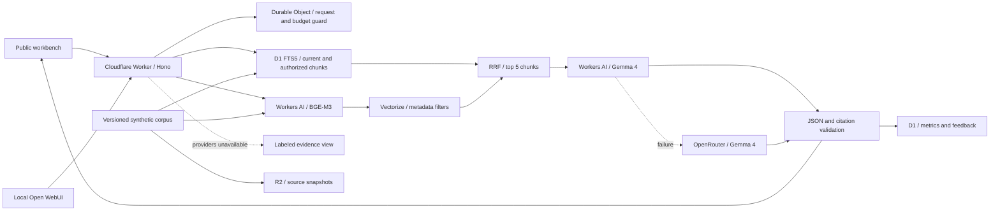

# RAGNA

### Evidence before answers.

A RAG engineering workbench by [Serkan Azeri](https://www.serkanazeri.com/). Explore a fictional service operation, inspect every source, compare retrieval decisions, and follow a request from search to a validated response.

**[Live workbench](https://ragna.serkanazeri.workers.dev)** · [Architecture](docs/architecture.md) · [Evaluation protocol](docs/evaluation.md) · [Deployment runbook](docs/deployment.md) · [Open WebUI](integrations/open-webui/README.md)

> A reference implementation for Forward Deployed AI Engineering: problem framing, data contracts, access boundaries, measurement, deployment, and failure handling in one inspectable system.


## The operational problem

A service team must answer changing questions about returns, warranty, support priority, repairs, and equipment loans. Answers can depend on multiple policies; an obsolete policy can be plausible and wrong. Internal commercial terms must remain outside a public visitor's retrieval context.

**Aster Mobility is fictional.** Every policy is synthetic. No employer documents, customer conversations, CV contents, or confidential business data are included.

The first release makes this problem observable:

- **Ask and inspect:** Turkish/English questions, source excerpts, version/date provenance, response origin, request traces, feedback, and JSON export.
- **Compare retrieval:** reproducible chunking experiments, Recall@5, MRR, nDCG@5, question-level results, and access-leak regressions.
- **Operate:** real request counts, latency, provider/fallback information, reported cost, and explicit quota behavior.
- **Deploy independently:** the public application runs on Cloudflare; a closed laptop does not take the demo offline.
- **Work locally:** Open WebUI connects to the same API; an optional Pipe emits native citation events. Ollama can run Gemma 4 locally.

## Quick start

Requires Node 22.12+ and npm. No model key or Cloudflare login is needed for the local evidence walkthrough.

```bash
npm ci
npm run secrets:init
npm run db:local
npm run build
npm run preview
```

Open **http://localhost:8787**. Ask a question to inspect retrieval, or select **Recorded walkthrough** to display a clearly labeled reference fixture. For hot reload, run `npm run dev` and open port 5173.

```bash
npm run check          # TypeScript, production build, tests, reproducible retrieval evaluation
npm run test:smoke     # Requires the local API on 8787
```

### Enable inference

Add `OPENROUTER_API_KEY=...` to the ignored `.dev.vars` file. Never put it in browser code or a commit. OpenRouter is a server-side credit-backed provider with price ceilings; its free model tier is not treated as an availability guarantee.

For local Ollama, add `OLLAMA_BASE_URL=http://localhost:11434` to `.dev.vars`, pull a supported Gemma 4 variant, then run:

```bash
ollama pull gemma4:e4b
npx wrangler dev --port 8787 --var MODEL_ROUTE:local-first
```

Use `--var LOCAL_MODEL:gemma4:12b-mlx` if that model is already installed and supported on your machine. Local hardware, quantization, and latency require their own measurements; local and cloud variants are not assumed equivalent.

## Architecture



The React build and API deploy together through **Workers Static Assets**. This is a deliberate simplification of a separate Pages frontend: one origin, one release, no cross-origin credentials, and no separate frontend/backend version drift. Open WebUI remains a local engineering interface; it is not embedded in a serverless Worker.

**Cloudflare Tunnel is optional.** It can expose a deliberately authenticated local endpoint for an experiment. It cannot keep a laptop service running when the laptop is off, and the public demo never depends on it.

## Engineering decisions

| Decision                                           | Rationale                                                                                                                                         | Evidence and tradeoff                                                                                                                                                                                       |
| -------------------------------------------------- | ------------------------------------------------------------------------------------------------------------------------------------------------- | ----------------------------------------------------------------------------------------------------------------------------------------------------------------------------------------------------------- |
| BGE-M3, 1024 dimensions                            | Multilingual document/query embeddings through the same hosted model; query embedding stays available when the laptop is off                      | A deployment candidate, not a claim of universal model superiority. 51 fixture vectors consume 52,224 stored dimensions. [Model documentation](https://developers.cloudflare.com/workers-ai/models/bge-m3/) |
| Section windows, 450 estimated tokens, 10% overlap | Preserve policy headings, citations, dates, and authorization metadata                                                                            | The lexical experiment favors fixed windows. The section configuration remains a hypothesis pending matched cloud evaluation. Small sections make the 250/450 variants identical on much of this fixture.   |
| FTS5 + dense search + RRF                          | Exact policy identifiers and multilingual paraphrases need different retrieval signals; rank fusion avoids pretending their scores are calibrated | Top 20 candidates from each path, RRF constant 60, final top 5 chunks. The offline BM25 implementation is a diagnostic baseline, not the same engine as D1 FTS5.                                            |
| Gemma 4 through Workers AI; OpenRouter fallback    | Stable cloud endpoint without hosting GPUs; fallback uses the user's existing provider credits                                                    | Each route is timed and labeled. No provider retry loop. A provider can still fail, rate-limit, or reject structured output.                                                                                |
| Citation validation before delivery                | Reject unknown identifiers, uncited non-abstaining answers, and malformed structured output                                                       | Identifier validity is **not** semantic faithfulness. The system can still produce a wrong claim attached to a valid source ID.                                                                             |
| SQL and vector metadata filtering                  | Authorization and current-version constraints must be applied before model context is assembled                                                   | Public prompts cannot grant operations access; results are checked again after retrieval. This is a two-scope demonstration, not production identity management.                                            |
| Small explicit pipeline                            | Keep retrieval, routing, evaluation, and cost boundaries visible in review                                                                        | Hono + typed functions instead of an orchestration framework. Larger workflows may justify a framework later.                                                                                               |
| Conservative budget reservation                    | Limit paid-provider exposure before inference starts                                                                                              | Serialized reservations, 100 model requests/day, 6 public requests/minute per hashed IP, default $1 daily reservation cap. Reservations are not invoices or a Cloudflare account-wide billing cap.          |

EmbeddingGemma and other multilingual encoders remain experiment candidates. A fair comparison must hold the corpus, split, chunking, distance metric, and question set fixed, and include Turkish/English recall, latency, storage, and laptop-independent query embedding. It is not valid to choose a model solely from a leaderboard or dimension count.

## Measurement, with boundaries

### Deployed retrieval — 2 October 2026

| Same section chunks, same 60 questions |  Recall@5 | Held-out recall |    nDCG@5 | Retrieval p95 | Access leaks |
| -------------------------------------- | --------: | --------------: | --------: | ------------: | -----------: |
| D1 FTS5                                |     61.4% |           55.0% |     0.576 |         39 ms |            0 |
| D1 FTS5 + BGE-M3 + RRF                 | **95.4%** |       **95.0%** | **0.902** |        527 ms |            0 |

The improvement costs an additional embedding/vector round trip. The 24-question test split contains 20 answerable questions. Measurements are a single sequential run on synthetic data, not a concurrent-load benchmark. [Raw deployed retrieval evidence](reports/cloud-retrieval.json).

The first 24-question generation run reached Workers AI for all requests, but revealed language-following failures and an abstention-label mismatch. These findings are preserved in the [generation baseline](reports/generation-baseline.json). The revised prompt and validator were checked on five [targeted regressions](reports/generation-regression.json); these cases are no longer an untouched holdout. The stock paraphrase still misses the needed source and correctly falls back to model abstention. A new blind set is required before claiming a general answer-quality improvement.

### Offline chunking ablation

Committed results come from `npm run evaluate`, across 60 deterministic synthetic questions. These are **document-level** scores over the unique documents represented by the first five retrieved chunks.

| Offline in-memory lexical configuration | Recall@5 |   MRR | nDCG@5 | Access leaks |
| --------------------------------------- | -------: | ----: | -----: | -----------: |
| Section-aware / 250                     |    0.596 | 0.580 |  0.577 |            0 |
| Section-aware / 450                     |    0.596 | 0.580 |  0.577 |            0 |
| Fixed window / 450                      |    0.676 | 0.613 |  0.623 |            0 |

These numbers expose a useful failure: lexical retrieval misses paraphrases and English queries against Turkish policies. They are not generated-answer accuracy. Zero observed leaks describes this fixture, not proof of comprehensive security.

**Question families:** 48 single-hop questions (direct Turkish, Turkish paraphrase, English), plus 12 multi-hop, temporal, unanswerable, access-control, and adversarial scenarios. Policy families are separated between development and test; edge cases intentionally revisit known policies. Corpus and question hashes are recorded with results.

| Layer             | Measured                                                                                       | Explicitly not inferred                                      |
| ----------------- | ---------------------------------------------------------------------------------------------- | ------------------------------------------------------------ |
| Retrieval         | Recall@5, MRR, nDCG@5, forbidden/stale result count, retrieval latency                         | Answer correctness                                           |
| Response contract | JSON shape, permitted citation IDs, response origin                                            | Semantic entailment or calibrated confidence                 |
| Operations        | Request traces, p50/p95, fallback reason, provider/model, reported token/cost fields, feedback | Availability SLO from a single session, missing cost as zero |
| Live evaluation   | Reference-term coverage, cited evidence recall, abstention match, provider/mode                | Human correctness from a lexical term match                  |

The UI separates **live model**, **recorded example**, **evidence only**, and **abstained**. A recorded answer never masquerades as a working model. SSE in the OpenAI adapter is **buffered after validation**; true token streaming and model TTFT are not implemented.

```bash
RAGNA_URL=https://your-worker.workers.dev npm run evaluate:retrieval
RAGNA_URL=https://your-worker.workers.dev EVAL_LIMIT=12 npm run evaluate:live
```

Live reports are ignored by Git until reviewed for publication. See the [evaluation protocol](docs/evaluation.md) for acceptance criteria and review practice.

## Synthetic data workflow

`data/corpus.json` contains 19 fictional source documents: 17 current public documents, one operations-only document, and one archived policy. `data/sources/` preserves readable Markdown exports. The fixture generator produces 51 chunks under the current configuration.

1. Define policy facts and access/version metadata.
2. Derive deterministic regression questions and reference evidence.
3. Optionally run `npm run synthetic` to generate Gemma candidates through OpenRouter.
4. Validate that each candidate's evidence quote is an exact source substring.
5. Save candidates with `pending-review` status. Review semantic answer support and split contamination before promotion.
6. Re-run retrieval and live generation evaluations after a change.

The current fixed dataset is programmatically evidence-checked and **has not been human-reviewed**. Candidate generation does not automatically modify the benchmark. Public document uploads are intentionally absent: the demo stays reproducible and avoids unbounded embedding cost and visitors' confidential data.

Local candidate generation is also supported:

```bash
SYNTHETIC_PROVIDER=ollama LOCAL_MODEL=gemma4:12b-mlx SYNTHETIC_DOCUMENTS=1 npm run synthetic
```

Three actual locally generated candidates, with exact evidence quotes and pending review status, are preserved in [the sample report](reports/synthetic-sample.json). They are not part of the 60-question benchmark.

## Resilience and cost

- Public cloud route: Workers AI → OpenRouter (when a key is configured) → labeled evidence excerpts.
- Development local route: Ollama → available cloud providers → labeled evidence excerpts.
- Embedding/index failures fall back to lexical retrieval. A corpus hash must match before the vector index is enabled.
- Workers AI generation has a 12-second bound; OpenRouter 20 seconds; query embedding 5 seconds; vector search 3 seconds. Timed-out Workers AI work may continue upstream and consume quota.
- OpenRouter price ceilings are $0.25/M input and $1/M output; output is capped at 1,024 tokens and the serialized prompt at 20 KB. These are admission controls, not price forecasts.
- Guided walkthroughs do not consume model reservations. Once live inference is unavailable or the demo budget is exhausted, source exploration and recorded examples remain usable while the hosting quotas allow it.

Cloudflare's free allowances are finite, and a free deployment is not an uptime guarantee. [Workers pricing](https://developers.cloudflare.com/workers/platform/pricing/), [Workers AI pricing](https://developers.cloudflare.com/workers-ai/platform/pricing/), and [Vectorize pricing](https://developers.cloudflare.com/vectorize/platform/pricing/) should be checked before changing the corpus, traffic limit, or model. No paid-plan upgrade is required by this repository's setup.

## Project map

```text
src/                      React workbench and responsive styles
worker/                   API, provider routing, and Durable Object guard
core/                     Typed contracts, chunking, ranking, validation
data/                     Synthetic documents and regression questions
migrations/               D1 schema and versioned fixture seed
reports/                  Reproducible offline results
scripts/                  Provisioning, indexing, evaluation, candidate generation
integrations/open-webui/  Native citation Pipe and setup guide
tests/                    Retrieval and provider contract regressions
docs/                     Architecture, evaluation, deployment
```

## Boundaries and next experiments

This release is a bounded portfolio demo. Production work would add real identity/tenant policy, reviewed customer data, asynchronous ingestion, delete/retention workflows, external uptime probes, a calibrated semantic evaluator, representative load tests, and account-level billing alarms.

Next experiments are driven by observed failures: document diversity/reranking when chunks crowd the context, matched embedding comparisons for bilingual queries, answer faithfulness review, and chunk-boundary ablations on longer policies. Caching, reranking, and a queue are not claimed as implemented optimizations without measured need.

## License

RAGNA code and authored synthetic fixtures are MIT licensed. Gemma model terms, Open WebUI's license/branding requirements, and provider terms remain separate. Open WebUI is used as its own product without removing its branding.
