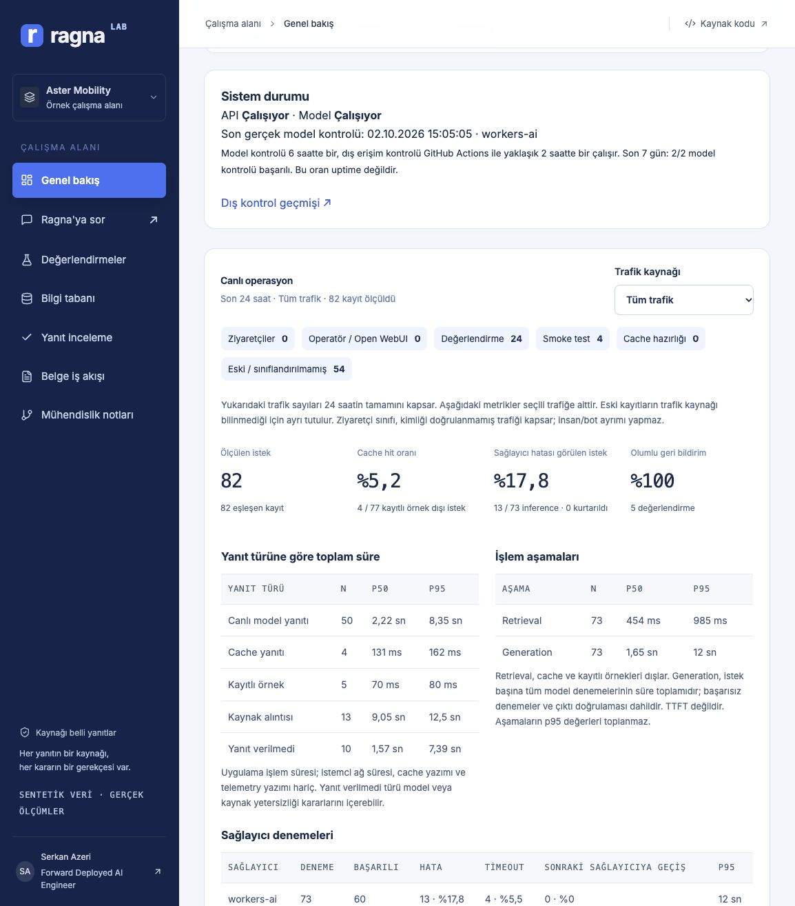

# İlk sürüm doğrulaması — 2 Ekim 2026

| Kontrol                        | Kanıt                                                                                                                              |
| ------------------------------ | ---------------------------------------------------------------------------------------------------------------------------------- |
| TypeScript ve production build | `npm run build` başarılı                                                                                                           |
| Regresyon testleri             | Retrieval yetkilendirmesi/sürümleme, atıf doğrulaması, sağlayıcı fallback'i, bağlam sınırı ve sıralı bütçe işlemleri               |
| Offline değerlendirme          | 60 soru × 3 chunk yapılandırması; ham sonuçlar depoda                                                                              |
| Bulutta retrieval              | 60 FTS5 ve 60 hybrid isteği; bu sentetik veri kümesinde Recall@5 %61,4 → %95,4                                                     |
| Canlı yanıt üretimi            | 24/24 istek Workers AI'a ulaştı; kaynak/yanıt ayrıntıları üretim baseline raporunda                                                |
| Hedefli düzeltmeler            | İngilizce yanıtlar ve abstention kararları 5 açık regresyon senaryosunda kontrol edildi; genelleme iddiası yok                     |
| Vektör etkinleştirme           | 51 vektörün tamamı eşleşen corpus hash ile doğrulandı; API doğrulama grupları 20 kimlik sınırına uyuyor                            |
| Sentetik üretim                | Yerel `gemma4:12b-mlx`, birebir kaynak alıntılarıyla 3 aday üretti; insan incelemesi bekliyor                                      |
| Open WebUI                     | Sabitlenmiş v0.11.1 container sağlıklı; Pipe container içinden gerçek API'ye bağlanarak yanıt, atıf ve durum olayları üretti       |
| Tarayıcı                       | Masaüstü genel bakış/değerlendirme ve kayıtlı yanıt akışı kontrol edildi; 390 px mobil görünümde sayfa genelinde yatay taşma yoktu |
| OpenRouter                     | Sağlayıcı adaptörü ve fallback, sözleşme testleriyle kapsandı; isteğe bağlı canlı yol için operatör API anahtarı yapılandırılmadı  |

Open WebUI'ın ilk yönetici hesabının oluşturulması operatöre bırakıldı. OpenAI uyumlu bağlantısı Compose ile yapılandırıldı; isteğe bağlı native atıf Pipe'ı yönetim arayüzünden içe aktarılabilir.

Container ile ana makine arasındaki entegrasyon; gerçek model keşfi, yerel `gemma4:12b-mlx` inference ve buffer'lı OpenAI uyumlu SSE yanıtını da başarıyla tamamladı. Kontrol edilen Türkçe iade sorusu, atıflı 30 gün yanıtını 5,16 saniyede üretti. İlk 12 saniyelik yerel çağrı zaman aşımına uğradı; thinking'in kapatılması ve yerel zaman aşımının 45 saniyeye çıkarılması gözlenen sorunu çözdü. Bu tek bir işlev kontrolüdür; latency benchmark değildir.

İlk yayımlanan commit, GitHub Actions doğrulamasını (`Verify`, çalışma `36994656588`) geçti. Bu çalışma temiz bağımlılık kurulumu, biçim kontrolü, build, regresyon testleri ve offline değerlendirmeyi kapsadı.

Cloudflare model çıktısı daha yeni, OpenAI biçiminde bir `choices` zarfı kullanır. İlk entegrasyon çalışması bu uyumsuzluğu ortaya çıkardı; adaptör ve regresyon testi artık bu zarfı kapsıyor. Test başarısızlıkları operasyon panelinin 24 saatlik penceresinde görünür kalır; gösterilen başarı oranını artırmak için silinmez.

İlk üretim çalışmasında stok sorusunun parafrazında retrieval eksikliği, İngilizce sorulara Türkçe yanıtlar ve abstention alanı/metni arasında tutarsızlıklar görüldü. Sonraki değişiklikler gözlenen durumları iyileştirdi. Sabit abstention mesajı ham protokol metninin gösterilmesini önler. Yanıtların anlamsal doğruluğu henüz insan tarafından puanlanmadı.

## v0.2 doğrulaması — 2 Ekim 2026

- 33 otomatik test: TTL, kaynak/sürüm/erişim değişimi, bilinmeyen atıf, config invalidation, yetkili cache bypass ve quota dolduğunda cache erişimi dahil.
- Gerçek yerel API: Gemma yanıtı 9.273 ms, aynı sorunun cache yanıtı 4 ms; model rezervasyon sayısı 6 → 7 → 7. Tek fonksiyonel kontrol; latency benchmark değildir.
- Türkçe arayüzde cache etiketi, üretim zamanı, sağlayıcı ve kaynak penceresi görüldü.
- Genel bakış, sohbet, değerlendirmeler, bilgi tabanı ve mühendislik notları; 320/390/768/1024/1440 px genişliklerde kontrol edildi. 25 kombinasyonda sayfa genelinde yatay taşma yoktu. Tablolar ve mobil soru kartları kendi alanlarında kaydırılabilir. Bu test fiziksel cihaz testi değildir.
- Chrome'da service worker kurulduktan sonra yerel sunucu durduruldu; sayfa yeniden yüklendiğinde uygulama arayüzü açıldı ve API erişimi için Türkçe bağlantı uyarısı gösterildi. Kullanıcının cihazına uygulama kurulmadı; Safari/iOS gerçek cihaz kurulumu ayrıca kontrol edilmelidir.
- Manifest, 192/512 px PNG ikonlar, maskable ikon, aynı origin'den Inter fontları ve versiyonlanmış static precache eklendi. API yanıtları browser cache'ine dahil edilmedi.
- Canlı Cloudflare smoke kontrolü geçti. Dört kaynaklı örnek yanıt Workers AI ile hazırlanarak cache'e alındı; yanıtlanamayan iki örnek saklanmadı. Aynı sorunun iki anonim isteği `cached` döndü, ayrı request ID üretti ve model rezervasyon sayısı 47 → 47 kaldı. Bu isteklerde model token kullanımı sıfırdı; dashboard iki cache hit gösterdi.
- Cloudflare v0.2 dağıtımı: `1f5753f7-555d-4d0b-9b65-51adbc59f346`. Manifest, service worker ve ikonlar canlıda HTTP 200 döndü. README ekran görüntüsü canlı Türkçe arayüzden yenilendi.

## Ayrıştırılmış dashboard doğrulaması — 2 Ekim 2026

- 41 otomatik test; cache/canlı süre ayrımı, boş ve bozuk örneklemler, percentile hesabı, hata/timeout/fallback paydaları, trafik etiketi sahteciliği ve SQL filtresinin limitten önce uygulanması dahil.
- Yeni smoke kontrolü, kendi request ID'sinin smoke grubunda bulunduğunu ve ziyaretçi grubuna girmediğini doğrular.

## v0.3 kalite ve operasyon doğrulaması — 2 Ekim 2026

- `npm run format:check` ve `npm run check` geçti: 6 test dosyasında 51 test, TypeScript, production build/PWA ve 60 soru × 3 offline retrieval koşusu.
- Sabit baseline'a göre kalite kapısı geçti: global/test split Recall@5 ve nDCG@5 değişimi 0; erişim sızıntısı 0. Olumsuz regresyonlar, eksik soru/deney ve dataset değişimi ayrı testlerle kapıyı başarısız yapıyor.
- Belge CLI akışı izole geçici dizinde uçtan uca çalıştırıldı: önizleme → sürüm artışı → yeni hash/SQL migration; eski öneriyi ikinci kez uygulama reddedildi. Gerçek corpus içeriği değiştirilmedi.
- Canlı tarayıcıda belge v2 → v3 önizlemesi 3 chunk üretti; artmayan sürüm Türkçe hata verdi. Önizleme canlı belgeyi değiştirmedi.
- 40 soruluk inceleme seti için gerçek API sonuçları kaydedildi: 32 `live`, 7 `abstained`, 1 `evidence`. Son kayıt, `workers-ai:invalid_citations_or_schema` nedeniyle kaynak alıntısı fallback'idir; model başarısı sayılmaz. Tüm atıflar güncel açık belgelere ait. İnsan incelemesi sayısı 0; doğruluk oranı üretilmedi.
- Genel bakış, sohbet, değerlendirmeler, bilgi tabanı, yanıt inceleme, belge iş akışı ve mühendislik notları; 320/390/768/1024/1440 px genişliklerde kontrol edildi. 35 kombinasyonda sayfa genelinde yatay taşma yok. [Ham UI kontrolü](../reports/ui-verification-v03.json). Fiziksel cihaz testi değildir.
- Yanıt incelemede 40 kayıt, kaynaklar, boş insan puanları ve fallback nedeni görüldü. Canlı tarayıcıda console error yoktu.
- Anonim model sağlık kontrolü başlatma isteği HTTP 401 döndü; yetkili istek gerçek Workers AI çağrısıyla başarılı oldu. Health API D1 ve son model sonucunu ayrı raporladı.
- Son dağıtımda canlı smoke ve dış monitor kontrolleri geçti: kaynak/erişim, kayıtlı yanıt, geri bildirim, trafik filtresi, arayüz ve PWA manifest. Smoke request ID'si ziyaretçi grubuna girmedi.
- Cloudflare dağıtımı: `962b064b-d25c-43ce-8214-7b433060e580`. Worker cron 6 saatte bir model kontrolü için etkin. GitHub dış kontrolü 2 saatte bir çalışacak şekilde yapılandırıldı; e-posta teslimi ayrıca doğrulanmadı.

